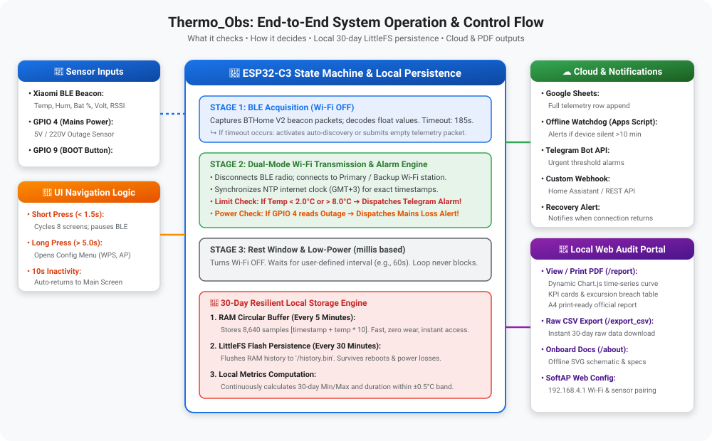
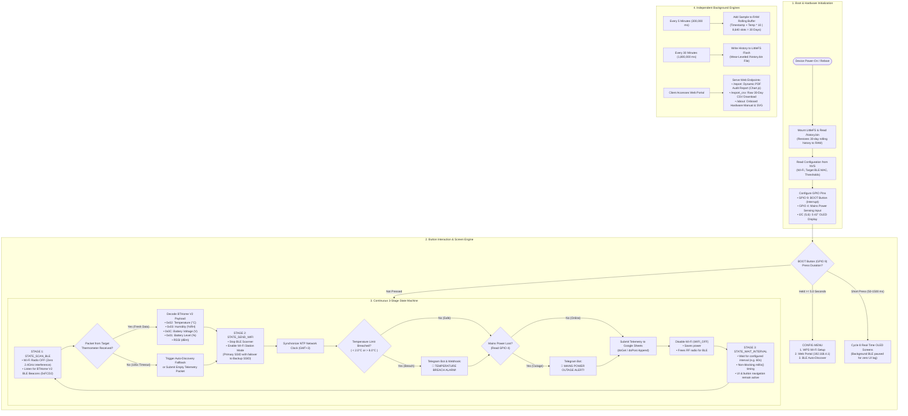

# Thermo_Obs: System Architecture, Operation Workflow & Control Logic

This document provides a comprehensive technical breakdown of **Thermo_Obs**: what it monitors, how it evaluates thresholds, how it ensures flash memory longevity, and how it handles communications and user interaction.

---

## 🗺️ System Workflow Architecture

Below is the complete architectural overview illustrating how sensor inputs flow through the ESP32-C3 decision engine to local storage, OLED telemetry, and cloud reporting channels:

---

## 🔄 End-to-End Operation Flowchart (Mermaid)

---

## 📋 Decision Matrix: What It Checks & What Actions It Takes

| Monitored Parameter | Detection Mechanism | Nominal Condition | Excursion Condition | Executed Actions |
| :--- | :--- | :--- | :--- | :--- |
| **Cold-Chain Temperature** | BLE BTHome V2 payload decoded every read cycle | $+2.0^\circ\text{C} \le T \le +8.0^\circ\text{C}$ | $T < 2.0^\circ\text{C}$ (Freeze risk) or $T > 8.0^\circ\text{C}$ (Heat risk) | • Dispatches urgent **Telegram alarm** with device name & temp. • Flags excursion in **Google Sheets** log row. • Adds excursion timestamp to **`/report`** audit table. |
| **Mains Grid Power** | Hardware optocoupler / voltage divider on `GPIO 4` | 5V Present (`isPowerOutage = false`) | 0V Outage (`isPowerOutage = true`) | • Immediately switches to emergency thresholds. • Sends **Mains Power Loss alert** via Telegram & Webhook. • Logs outage state to Google Sheets. |
| **Thermometer RF Link** | Software watchdog on last received BLE packet time | Packet received within `stageTimeoutSec` (185s) | No packet received for $> 185\text{ s}$ | • Displays `! WARNING ! Thermometer No Signal` on OLED. • Automatically triggers nearest-beacon discovery. • Transmits empty packet to cloud to log signal loss. |
| **Wi-Fi Connectivity** | Dual-AP connection retry state machine | Primary Wi-Fi connects within 8 seconds | Primary Wi-Fi down / unreachable | • Automatically switches to configured Backup Wi-Fi. • If both fail: buffers data in LittleFS; displays offline warning. |
| **Thermometer Battery** | Decoded battery percentage & voltage | Battery $> 2.60\text{V}$ ($> 20\%$) | Battery $< 2.50\text{V}$ ($\le 15\%$) | • Displays low battery warning on OLED Screen 3. • Logs low-battery indicator in cloud telemetry. |

---

## 💾 30-Day Local Data Persistence & Wear-Leveling Engine

To protect against unexpected power outages or router restarts without wearing down the microcontroller flash memory, Thermo_Obs uses a **hybrid RAM-to-Flash memory architecture**:

1. **RAM Rolling Buffer (5-Minute Granularity):**
   - Stores $8,640$ entries ($30\text{ days} \times 24\text{ hours} \times 12\text{ samples/hour}$).
   - Struct footprint per sample: `uint32_t timestamp` (4 bytes) + `int16_t temp` (2 bytes) = **6 bytes**.
   - Total RAM footprint: $8,640 \times 6\text{ bytes} \approx 51.8\text{ KB}$ (safely fits in ESP32-C3 dynamic memory).

2. **LittleFS Wear-Leveled Flash Persistence (30-Minute Interval):**
   - RAM buffer is flushed to `/history.bin` once every 30 minutes (48 writes per day).
   - ESP32-C3 onboard NOR flash rated for 100,000 write cycles.
   - Wear-leveling math: $\frac{100,000\text{ cycles}}{48\text{ writes/day}} \approx 2,083\text{ days} \approx \mathbf{5.7\text{ to }15+\text{ years}}$ of continuous operation without flash degradation.
   - In case of sudden power loss, at most the last 30 minutes of telemetry are lost; the entire preceding 30 days of data are restored immediately upon reboot.

---

## 📱 User Interface & Screen Architecture

The UI uses a single physical push-button (`GPIO 9`) connected with an internal pull-up and interrupt:

- **Short Press (50ms – 1500ms):**
  - Instantly advances to the next of **8 informative OLED screens** (Temperature, Humidity, Battery, RSSI, 30-day Min, 30-day Max, Wi-Fi details, BLE details).
  - Pauses background BLE scanning while browsing to eliminate display stutter, flicker, and lag.
  - Returns to the primary screen after 10 seconds of user inactivity.
- **Long Press (>= 5.0 Seconds):**
  - Fills an on-screen animated progress bar and enters the **Configuration Menu**.
  - Provides access to WPS pairing, the standalone SoftAP Web Portal (`192.168.4.1`), and BLE Auto-Discovery.
  - Automatically saves history and soft-reboots after 10 seconds of menu inactivity.

---

## 🎯 4-Point Laboratory Calibration & Traceability Engine

For pharmaceutical cold storage, multi-point calibration against a certified laboratory reference thermometer is mandatory. Thermo_Obs features a built-in 4-point calibration engine:

### 1. Reference Points & Piecewise Linear Interpolation
- **Reference Points:** $2.0^\circ\text{C}, 4.0^\circ\text{C}, 6.0^\circ\text{C}, 8.0^\circ\text{C}$.
- **Factory Defaults:** $r_2 = 2.0, r_4 = 4.0, r_6 = 6.0, r_8 = 8.0$.
- When a raw sensor reading $T_{raw}$ is received from the BLE thermometer, the calibrated temperature $T_{cal}$ is computed via piecewise linear interpolation:
  $$T_{cal} = T_{ref,i} + \frac{T_{ref,i+1} - T_{ref,i}}{r_{i+1} - r_i} \cdot (T_{raw} - r_i)$$

### 2. Standard Deviation ($\sigma$) & Error Evaluation
At the 4 calibration points, the deviation errors $d_i = r_i - T_{ref,i}$ are calculated. The system computes the mean error $\bar{d}$ and the sample standard deviation:
$$\sigma = \sqrt{\frac{1}{3}\sum_{i=1}^{4} (d_i - \bar{d})^2}$$
This value is stored in NVS and published on all official audit certificates.

### 3. Historical Traceability & Audit Integrity
- When calibration values are modified, the system records the exact calibration timestamp.
- **Historical Data Preservation:** Historical records in LittleFS flash are preserved with their original calibration values as recorded. The new calibration curve applies strictly to incoming telemetry from the update timestamp onward.
- **PDF Report & CSV Metadata:** Both `/report` and `/export_csv` output the active calibration date, the 4 reference points, individual offsets ($\Delta$), and the standard deviation ($\sigma$).

### 4. Optional Security Password Lock
- Administrators can set an optional password to lock the calibration menu.
- If a password is set, calibration parameters cannot be viewed or modified without entering the authorization key.
- **Fail-Safe Security:** If the password is forgotten, it cannot be bypassed through the web interface; the device firmware must be reflashed via USB serial to clear NVS storage.
