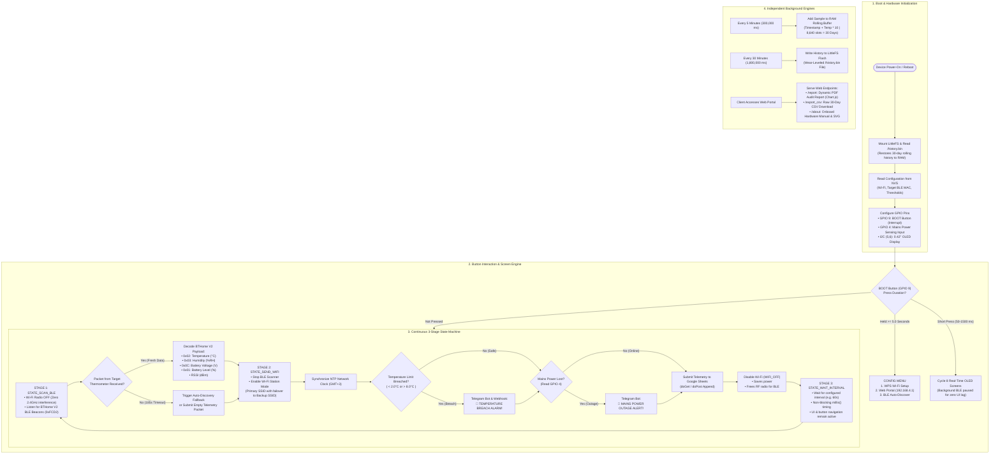

# Thermo_Obs: ESP32-C3 Smart Cold Chain Monitoring & Logging System

**Thermo_Obs** is an open-source, resilient **IoT Cold Chain Monitoring and Data Logging System** engineered to safeguard vaccines, pharmaceuticals, biological samples, and perishable foodstuffs across storage and transit.

Built around the ultra-compact **ESP32-C3 0.42" OLED development board** (RISC-V 32-bit @ 160MHz), it continuously captures temperature, relative humidity, battery level, and link quality from nearby **Xiaomi Mijia (LYWSD03MMC)** BLE thermometers running custom ATC / BTHome firmware. It maintains a **30-day wear-leveled historical record in onboard LittleFS flash**, synchronizes with **NTP internet time**, logs telemetry to Google Sheets, and serves a regulatory **audit-ready PDF report and raw CSV** directly through its built-in web portal.

---

## ⚠️ Disclaimer of Liability

> **This project is open-source and the workflows, scripts, or examples provided may not be error-free. The user is solely responsible for any errors, data loss, or other adverse consequences that may arise during the use of the software; the developer or project owners assume no liability for such damages.**
>
> *(This system is provided "as is" without warranty of any kind, express or implied. Users are solely responsible for hardware calibration, RF link testing, power fail-safe verification, and ensuring compliance with applicable regulatory cold-chain standards such as WHO PQS, FDA, or local health authority guidelines.)*

---

## 🗺️ System Architecture & Operation Workflow

Thermo_Obs monitors cold-chain conditions through a non-blocking state machine balancing BLE radio polling, dual-mode Wi-Fi failover, mains power monitoring, local 30-day wear-leveled flash persistence, and instant emergency alerts.

For a detailed technical walkthrough, check the dedicated guide: [**ABOUT.md (System Architecture & Control Logic)**](ABOUT.md).


<details>
<summary><b>🔍 Click to view interactive End-to-End Mermaid Flowchart</b></summary>


</details>

---

## 📱 Visual Menu & Screen Hierarchy

The entire device interface is operated using a **single physical button (BOOT button - GPIO 9)**.

### 1. Navigation Flowchart & State Machine

```text
[Normal Operation / Real-Time Telemetry Screens]
   │
   │─── (Hold BOOT button for 5 seconds) ───► [Progress Bar: Opening Menu..]
   │
   ▼
┌────────────────────────────────────────────────────────────────────────┐
│                              CONFIG MENU                               │
├──────────────────────┬──────────────────────────┬──────────────────────┤
│    1. WPS Setup      │      2. Web Portal       │     3. Discover      │
├──────────────────────┼──────────────────────────┼──────────────────────┤
│ Press the WPS button │ Starts a standalone      │ Performs an active   │
│ on your router to    │ Wi-Fi Access Point:      │ scan for nearby BLE  │
│ pair Wi-Fi           │   SSID: Thermo_Obs       │ thermometers; pairs  │
│ automatically without│   IP  : 192.168.4.1      │ with the strongest   │
│ typing a password.   │ Access configuration,    │ advertising beacon.  │
│                      │ PDF reports, & CSV.      │                      │
└──────────────────────┴──────────────────────────┴──────────────────────┘
   │
   └────► (10 seconds of inactivity flushes history to LittleFS and triggers soft reboot)
```

---

### 2. OLED Display Mockups (0.42" SSD1306 - 72x40 Visible Pixel Window)

In normal operation mode, a **short press of the BOOT button** advances to the next information screen. Active background RF scanning is temporarily halted during user navigation to provide instant, flicker-free readability. The interface automatically returns to Screen 1 after 10 seconds of inactivity.

```text
Screen 1: Primary Temperature & Link    Screen 2: Relative Humidity
┌──────────────────────────────┐        ┌──────────────────────────────┐
│  ATC_2A40            w:V b:V │        │  HUMIDITY                    │
│                              │        │                              │
│         4.8°                 │        │            %58 RH            │
│                              │        │                              │
└──────────────────────────────┘        └──────────────────────────────┘
(w: Wi-Fi status, b: Bluetooth)         (Relative humidity percentage)

Screen 3: Sensor Battery & Voltage      Screen 4: Bluetooth Signal (RSSI)
┌──────────────────────────────┐        ┌──────────────────────────────┐
│  BATTERY                     │        │  BLE SIGNAL                  │
│                              │        │                              │
│         %98   3.04V          │        │           -62 dBm            │
│                              │        │                              │
└──────────────────────────────┘        └──────────────────────────────┘
(CR2032 coin cell % and voltage)        (Received signal strength in dBm)

Screen 5: 30-Day Minimum Temp           Screen 6: 30-Day Maximum Temp
┌──────────────────────────────┐        ┌──────────────────────────────┐
│  30d MINIMUM                 │        │  30d MAXIMUM                 │
│  +2.3°                       │        │  +7.6°                       │
│  18h (+-0.5)                 │        │  2.1d (+-0.5)                │
└──────────────────────────────┘        └──────────────────────────────┘
(30-day min temp & hours in band)       (30-day max temp & days in band)

Screen 7: Wi-Fi Network Telemetry       Screen 8: Paired Sensor Identity
┌──────────────────────────────┐        ┌──────────────────────────────┐
│  WIFI INFO                   │        │  BLE SENSOR INFO             │
│  SSID: ColdRoom_2G           │        │  Name: ATC_2A40              │
│  State: Connected            │        │  MAC: A4:C1:38:2A:40:11      │
│  IP: 192.168.1.105           │        │  RSSI: -62 dBm               │
└──────────────────────────────┘        └──────────────────────────────┘
(Active SSID & DHCP IP address)         (Sensor Bluetooth MAC & name)

Interactive Configuration Menu (Hold BOOT for 5 seconds):
┌──────────────────────────────┐
│         CONFIG MENU          │
│  > 1.WPS Setup               │
│    2.Web Portal              │
│    3.Discover                │
└──────────────────────────────┘
(Short press: Change selection | Hold 2s: Launch selected action)
```

---

## 🛠️ Hardware Architecture & Pinout Map

| Component | Model / Description | Pinout / ESP32-C3 GPIO |
| :--- | :--- | :--- |
| **Mainboard** | **ESP32-C3 0.42" OLED Development Board** (RISC-V 160MHz, 4MB Flash) | All-in-one MCU & display board |
| **OLED Display** | 0.42" SSD1306 Monochrome I2C (72x40 active window) | `SCL: GPIO 6` , `SDA: GPIO 5` |
| **Control Button** | On-board `BOOT` push-button | `GPIO 9` (Internal Pull-Up, Active LOW) |
| **Wireless Sensor** | Xiaomi Mijia Bluetooth Thermometer 2 (**LYWSD03MMC**) | BLE 5.0 (BTHome V2 / ATC Beacon) |
| **Power Outage Sensor**| 5V USB sensing circuit / Voltage Divider *(See [Circuit Details](#-mains-power-outage-detection-circuit--modem-ups-architecture))* | `GPIO 4` (NVS-configurable Active Low/High) |

> 📌 **Board Pinout & Specs Reference:** [Codey Online - ESP32-C3 OLED 0.42" Pinout & Specs](https://codey.online/boards/esp32-c3-oled)

---

## ⚡ Mains Power Outage Detection Circuit & Modem UPS Architecture

Thermo_Obs features an independent, real-time **Mains Electricity Outage Detection Subsystem** tied to **GPIO 4**. This allows the device to distinguish between normal operations, battery-backed states, and grid blackouts—dispatching emergency alerts via Telegram, Webhooks, and Google Sheets the instant power is cut.

---

### 1. Operation Principle & Dual-Power Design

For the power outage detection subsystem to function correctly, the installation must follow a **Dual-Power topology**:
1. **ESP32-C3 Backup Power:** The ESP32-C3 board is powered continuously via a battery backup solution (e.g., a 3.7V Li-ion/Li-Po cell with charging module, an 18650 UPS shield, or an uninterruptible USB power bank with pass-through charging).
2. **Mains Electricity Sense Line (5V DC):** A secondary 5V USB wall adapter is plugged directly into the unbacked wall socket (representing raw grid power).
3. **Firmware Detection Logic (`GPIO 4`):**
   - **Grid Power Normal (ONLINE):** The 5V sense line is live. The voltage divider outputs $\approx 3.3\text{V}$ (Logic HIGH) to GPIO 4.
   - **Grid Blackout (OUTAGE):** The 5V sense line collapses to $0\text{V}$. The pull-down resistor pulls GPIO 4 firmly to GND ($0\text{V}$, Logic LOW).
   - In firmware (`Thermo_Obs.ino`), with default setting `powerPinActiveLow = 1`:
     - `GPIO 4 == LOW (0V)` $\rightarrow$ `isPowerOutage = true` (Dispatches `⚡ MAINS POWER OUTAGE DETECTED!`)
     - `GPIO 4 == HIGH (3.3V)` $\rightarrow$ `isPowerOutage = false` (Dispatches `🔌 MAINS POWER RESTORED!`)

---

### 2. Voltage Divider Resistor Calculation

> [!CAUTION]
> **ESP32-C3 GPIO pins are strictly NOT 5V tolerant!**
> Applying 5V directly to GPIO 4 will permanently destroy the microcontroller pin. You **must** use a voltage divider or optocoupler circuit to step 5V down to safe 3.3V logic levels.

The voltage divider uses two standard resistors ($R_1$ and $R_2$):
$$V_{\text{out (GPIO 4)}} = V_{\text{in (5V)}} \times \frac{R_2}{R_1 + R_2}$$

| Resistor | Recommended Value | Alternative Value | Function |
| :--- | :---: | :---: | :--- |
| **$R_1$ (Upper Resistor)** | **$10\text{ k}\Omega$** (1/4W) | $4.7\text{ k}\Omega$ | Drops 5V to safe 3.3V logic level |
| **$R_2$ (Lower Resistor / Pull-down)** | **$20\text{ k}\Omega$** (1/4W) | $22\text{ k}\Omega$ or $10\text{ k}\Omega$ | Bridges GPIO 4 to GND; pulls pin to 0V when 5V collapses |
| **$C_1$ (Filter Capacitor - Optional)** | **$100\text{ nF}$** (0.1µF Ceramic) | $10\text{ nF}$ | Paralleled with $R_2$ to eliminate mains line transients / EMI spikes |

**Calculation:**
$$V_{\text{out}} = 5.0\text{V} \times \frac{20\text{ k}\Omega}{10\text{ k}\Omega + 20\text{ k}\Omega} = 5.0\text{V} \times \frac{2}{3} \approx 3.33\text{V} \quad (\text{Safe & optimal logic HIGH for ESP32})$$
*(If using standard $22\text{ k}\Omega$: $5.0\text{V} \times \frac{22}{32} = 3.43\text{V}$, safely within the 3.6V maximum limit).*

---

### 3. Wiring Schematics

#### Option A: Resistor Bridge / Voltage Divider (Simplest & Most Cost-Effective)

```text
  [ Mains 5V USB Adapter ]
         (+) 5V DC ───────────────────[ R1: 10 kΩ ]────────────────┬──────────► ESP32-C3 GPIO 4
                                                                   │
                                                            [ R2: 20 kΩ or 22 kΩ ]
                                                                   │
                                                            [ C1: 100 nF (Opt) ]
                                                                   │
         (-) GND ──────────────────────────────────────────────────┴──────────► ESP32-C3 GND
```

#### Option B: Galvanically Isolated Optocoupler Circuit (Industrial Grade)

For noisy industrial environments, an optocoupler (e.g. **PC817**) provides 100% electrical galvanic isolation:

```text
  [ Mains 5V DC ] ────[ R_limit: 1 kΩ ]────► (Pin 1: Anode)   PC817   (Pin 4: Collector) ────► ESP32-C3 GPIO 4
                                                                      (Pin 3: Emitter)   ────► ESP32-C3 GND
  [ Mains GND   ] ─────────────────────────► (Pin 2: Cathode)
  
  * Note: Use ESP32 internal pull-up on GPIO 4 (pinMode(4, INPUT_PULLUP)).
```

---

### 4. ⚠️ CRITICAL: Wi-Fi Modem / Router UPS Requirement

> [!IMPORTANT]
> **Why the Internet Router MUST be connected to an Uninterruptible Power Supply (UPS):**
> 
> - While the **ESP32-C3** runs on its local battery/power bank and the **BLE thermometer** runs on its internal CR2032 coin cell, **the Wi-Fi router / fiber GPON modem will die immediately during a blackout if plugged into raw wall power.**
> - If the modem shuts down:
>   - The Wi-Fi radio disappears.
>   - The ESP32-C3 detects the outage on GPIO 4 within milliseconds, but **cannot access the internet to dispatch the Telegram message or Google Sheets entry**.
> 
> **Required Topology:**
> Connect your home/office Wi-Fi router and fiber converter (ONT) to a **12V Mini DC-UPS**, battery backup adapter, or central computer UPS.
> 
> ```mermaid
> graph LR
>     subgraph MainsPower ["⚡ Mains AC 220V Grid"]
>         Mains["Wall AC Socket"]
>     end
> 
>     subgraph RouterPower ["🌐 Wi-Fi Router Subsystem"]
>         Mains -->|AC| RouterUPS["12V Mini DC-UPS / Backup Battery"]
>         RouterUPS -->|12V DC| Router["Wi-Fi Router / Fiber GPON<br/>(STAYS ALIVE DURING BLACKOUT)"]
>     end
> 
>     subgraph DevicePower ["❄️ Cold Chain Monitor Subsystem"]
>         Mains -->|5V USB Sense| Bridge["10k / 20k Resistor Divider"]
>         Bridge -->|0V to 3.3V Logic| GPIO4["GPIO 4 (Power Detect Pin)"]
>         Battery["ESP32-C3 UPS Shield / Battery"] -->|Continuous 3.3V/5V| ESP32["ESP32-C3 Board"]
>         GPIO4 --> ESP32
>     end
> 
>     ESP32 -.->|Instant Wi-Fi Connection| Router
>     Router -->|Internet Uplink| Cloud["Telegram Bot & Google Sheets Cloud<br/>🚨 Instant Outage Alert Dispatched!"]
> ```

---

### 5. What Happens if the Router Does NOT Have a UPS? (Fail-Safe Behavior)

If your Wi-Fi router loses power along with the grid:
1. **Local Wear-Leveled Logging Continues:** The ESP32-C3 continues recording temperature every 5 minutes directly into LittleFS flash memory on battery power. Zero cold-chain telemetry is lost.
2. **Automated Cloud Watchdog Trigger:** The Google Apps Script time-driven watchdog (`checkDeviceOffline()`) detects that no telemetry heartbeats arrived for $\ge 10$ minutes and sends an emergency email to the administrator:
   `🚨 DEVICE OFFLINE / TELEMETRY LOSS! No telemetry received for 10 minutes (possible power outage or Wi-Fi loss)`.
3. **Automatic Recovery on Power Restoration:** When grid power returns, the router reboots, GPIO 4 returns to HIGH, the ESP32 reconnects, flushes all stored flash logs, and dispatches `🔌 MAINS POWER RESTORED!` with connection recovery notices.

---

## 📚 Required Libraries & Versions

The firmware has been compiled and verified with the following components and core libraries:

| Library / Core | Recommended Version | Author / Source | Purpose / Installation |
| :--- | :--- | :--- | :--- |
| **esp32:esp32 (Core)** | **3.0.0 – 3.3.11** | [Espressif Systems](https://github.com/espressif/arduino-esp32) | `arduino-cli core install esp32:esp32` |
| **U8g2** | **2.36.19** (or $\ge 2.35$) | [olikraus (GitHub)](https://github.com/olikraus/u8g2) | `arduino-cli lib install "U8g2"` |
| **LittleFS** | Built-in | Espressif ESP32 Core | Wear-leveled persistent flash file system |
| **WiFi / WebServer / DNSServer** | Built-in | Espressif ESP32 Core | Captive portal & AP networking stack |
| **BLE (Bluetooth Low Energy)** | Built-in | Espressif ESP32 Core | Non-blocking BLE beacon advertisement scanner |
| **Chart.js** | **v4.x (CDN)** | [Chartjs.org](https://www.chartjs.org/) | Browser-rendered interactive time-series charts |

---

## 🚀 Step-by-Step Installation & Quickstart Guide

### Step 1: Flash Xiaomi Mijia Thermometer with Custom Firmware (1 Minute)
1. Open [TelinkMiFlasher by pvvx](https://pvvx.github.io/ATC_MiThermometer/TelinkMiFlasher.html) in a Web Bluetooth compatible browser (Google Chrome).
2. Click **Connect** and select your LYWSD03MMC thermometer.
3. Click **Do Activation**, then click **Custom Firmware (pvvx)** to flash.
4. Set the following recommended parameters:
   - **Advertising Type:** `BTHome V2` or `Custom / ATC`
   - **Advertising Interval:** `2500 ms` to `3500 ms`
5. Click **Send Settings**.

---

### Step 2: Compile & Flash the Firmware to ESP32-C3
Connect your ESP32-C3 board to your PC via a USB-C data cable (e.g., `COM4`).

**Option A: Using Arduino CLI (Command Line):**
```bash
# 1. Install board core and libraries
arduino-cli core install esp32:esp32
arduino-cli lib install "U8g2"

# 2. Compile using Huge App partition scheme
arduino-cli compile --fqbn esp32:esp32:esp32c3:CDCOnBoot=cdc,PartitionScheme=huge_app .

# 3. Flash to ESP32-C3 serial port
arduino-cli upload -p COM4 --fqbn esp32:esp32:esp32c3:CDCOnBoot=cdc,PartitionScheme=huge_app .
```

**Option B: Using Arduino IDE:**
1. Select `Tools -> Board -> ESP32 Arduino -> ESP32C3 Dev Module`.
2. Set `Tools -> USB CDC On Boot` to **Enabled**.
3. Set `Tools -> Partition Scheme` to **Huge APP (3MB No OTA/1MB SPIFFS)**.
4. Select your serial COM port and click **Upload**.

---

### Step 3: Device Initialization & Wi-Fi Configuration
1. Power on the device. **Hold the BOOT button for 5 seconds** until the loading bar fills to open the Config Menu.
2. Short press once to highlight `> 2.Web Portal`, then hold for 1.5 seconds to launch.
3. Connect your phone or laptop to the Wi-Fi network **`Thermo_Obs`** using the 8-digit password shown on the OLED screen.
4. Open **`http://192.168.4.1`** in any web browser:
   - **Wi-Fi Settings:** Enter your primary and optional backup Wi-Fi credentials.
   - **Thermometer Pairing:** Click **🔄 Scan Nearby Thermometers** (5 seconds) and select your target sensor from the discovered list.
   - **Thresholds:** Set standard storage limits (Default: $2.0^\circ\text{C}$ to $8.0^\circ\text{C}$).
   - **4-Point Calibration:** Map sensor readings against a certified master reference at $2.0^\circ\text{C}, 4.0^\circ\text{C}, 6.0^\circ\text{C}, 8.0^\circ\text{C}$ with automatic standard deviation ($\sigma$) calculation and optional security password lock.
   - **Alert Channels:** Enter your Google Sheets Web App URL, Telegram Bot Token, or Custom Webhook URL.
5. Click **💾 SAVE ALL & RESTART**. The device saves all parameters to NVS and begins monitoring.

---

### Step 4: Exporting 30-Day Audit Reports & CSV Data
At any point, access the Web Portal (`192.168.4.1`) or navigate via local network IP to access:
- **📄 View / Print PDF Report (`/report`):** Generates a print-ready A4 compliance audit report complete with a 30-day time-series curve (Chart.js), **Laboratory 4-Point Calibration Certificate with Standard Deviation ($\sigma$)**, Minimum/Maximum temperature timestamps, and excursion breach duration tables.
  - **🛡️ Cryptographic Tamper-Proofing Seal:** Employs the ESP32-C3 hardware SHA-256 accelerator to stamp every report with an immutable 64-character digest and unique Certificate ID (`CERT-XXXX-XXXXXXXX`).
  - **📱 Dynamic QR Code:** Embedded directly on the report, linking directly to the device's `/verify` authentication endpoint.
- **🛡️ Digital Audit Verification (`/verify`):** A dedicated verification portal confirming document authenticity, hardware MAC origin, and unaltered data status with a green verification badge.
- **📥 Download Raw CSV (`/export_csv`):** Downloads a clean, spreadsheet-compatible CSV with embedded SHA-256 digest, Certificate ID, calibration metadata headers, and every 5-minute measurement with exact timestamps.
- **ℹ️ About & Docs (`/about`):** Onboard technical manual including vector SVG flow diagrams, hardware pinouts, and regulatory liability documentation.

---

## 📊 Google Sheets Cloud Telemetry Setup

The project includes an intelligent cloud telemetry webhook and watchdog script (`google_sheets_script.js`) featuring:
- **Automatic Table Initialization:** Creates formatted headers on empty spreadsheets.
- **Cold Chain Excursion Alerts:** Dispatches immediate email notifications when temperatures fall outside safe bounds.
- **Mains Power Loss Alerts:** Detects when power detection circuitry flags an outage.
- **Automated Offline Watchdog:** Runs via a Google Apps Script time-driven trigger; alerts if no data is received within the timeout window.
- **Connection Recovery Notifications:** Sends an email when the device comes back online after an outage.

### Setup Instructions

1. Create a new Google Spreadsheet at [sheets.new](https://sheets.new).
2. Open **Extensions -> Apps Script** from the top menu.
3. Paste the following script (also available in [`google_sheets_script.js`](file:///C:/Users/meteg/.gemini/antigravity/scratch/Cold-Chain-Tracking-System/google_sheets_script.js)):

```javascript
// ==========================================
// --- CONFIGURATION ---
// ==========================================
const EMAIL_RECIPIENT = "mete.gokhan@gmail.com"; // Notification recipient email
const MIN_TEMP_LIMIT = 2.5;                      // Lower safe temperature limit (°C)
const MAX_TEMP_LIMIT = 7.5;                      // Upper safe temperature limit (°C)
const OFFLINE_TIMEOUT_MINUTES = 10;              // Inactivity timeout before triggering offline alert

function doGet(e) {
  return handleData(e);
}

function doPost(e) {
  return handleData(e);
}

function ensureHeaders(sheet) {
  if (sheet.getLastRow() === 0) {
    sheet.appendRow([
      "Date & Time",
      "Device Name",
      "Temp (°C)",
      "Humidity (%)",
      "Battery (%)",
      "Voltage (V)",
      "RSSI (dBm)",
      "Power Status",
      "Event Note"
    ]);
    sheet.getRange(1, 1, 1, 9).setFontWeight("bold").setBackground("#e8f0fe");
  }
}

function handleData(e) {
  try {
    const sheet = SpreadsheetApp.getActiveSpreadsheet().getActiveSheet();
    ensureHeaders(sheet);

    const params = (e && e.parameter) ? e.parameter : {};
    const now = new Date();
    const dateFormatted = Utilities.formatDate(now, "GMT+3", "dd.MM.yyyy HH:mm:ss");

    const device = params.device || "ATC_UNKNOWN";
    const temp = (params.temp === "-" || isNaN(parseFloat(params.temp))) ? "-" : parseFloat(params.temp);
    const hum = (params.hum === "-" || isNaN(parseFloat(params.hum))) ? "-" : parseFloat(params.hum);
    const bat = (params.bat === "-" || isNaN(parseInt(params.bat))) ? "-" : parseInt(params.bat);
    const volt = (params.volt === "-" || isNaN(parseFloat(params.volt))) ? "-" : parseFloat(params.volt);
    const rssi = params.rssi || "-";
    const pwr = params.pwr || "ONLINE";
    let note = params.note || "Normal";

    // 1. Temperature Excursion Check
    if (temp !== "-") {
      if (temp < MIN_TEMP_LIMIT || temp > MAX_TEMP_LIMIT) {
        note = "LIMIT BREACH!";
        sendAlertEmail(
          `⚠️ TEMPERATURE ALERT: ${device}`,
          `Attention!\n\n` +
          `Temperature reading from ${device} breached defined safety thresholds:\n\n` +
          `• Temperature: ${temp} °C (Allowed: ${MIN_TEMP_LIMIT}°C - ${MAX_TEMP_LIMIT}°C)\n` +
          `• Humidity: %${hum} RH\n` +
          `• Power State: ${pwr}\n` +
          `• Battery: %${bat} (${volt}V)\n` +
          `• Signal (RSSI): ${rssi} dBm\n` +
          `• Timestamp: ${dateFormatted}\n\n` +
          `Please inspect cold-room storage immediately.`
        );
      }
    }

    // 2. Mains Power Disconnection Check
    if (pwr === "OUTAGE") {
      note = (note === "Normal") ? "POWER OUTAGE" : note + " & POWER OUTAGE";
      sendAlertEmail(
        `🚨 MAINS POWER OUTAGE: ${device}`,
        `CRITICAL ALERT!\n\n` +
        `Mains electricity disconnection detected for ${device}.\n` +
        `System is currently operating on battery power.\n\n` +
        `• Current Temp: ${temp} °C\n` +
        `• Battery: %${bat} (${volt}V)\n` +
        `• Timestamp: ${dateFormatted}`
      );
    }

    // 3. Append Data Row
    sheet.appendRow([dateFormatted, device, temp, hum, bat, volt, rssi, pwr, note]);

    // 4. Connection Restored Check
    const wasOffline = PropertiesService.getScriptProperties().getProperty("OFFLINE_ALERTED");
    if (wasOffline === "true") {
      sendAlertEmail(
        `✅ CONNECTION RESTORED: ${device}`,
        `Notice:\n\n` +
        `Data transmission has resumed normally for ${device}.\n\n` +
        `• Current Temp: ${temp} °C\n` +
        `• Power State: ${pwr}\n` +
        `• Resumed at: ${dateFormatted}`
      );
    }

    // Update heartbeat tracking
    PropertiesService.getScriptProperties().setProperty("LAST_SEEN", now.getTime().toString());
    PropertiesService.getScriptProperties().setProperty("OFFLINE_ALERTED", "false");

    return ContentService.createTextOutput("OK").setMimeType(ContentService.MimeType.TEXT);
  } catch (error) {
    return ContentService.createTextOutput("ERROR: " + error.toString()).setMimeType(ContentService.MimeType.TEXT);
  }
}

// Time-Driven Watchdog Trigger
function checkDeviceOffline() {
  const lastSeenStr = PropertiesService.getScriptProperties().getProperty("LAST_SEEN");
  const offlineAlerted = PropertiesService.getScriptProperties().getProperty("OFFLINE_ALERTED");

  if (!lastSeenStr) return;

  const lastSeenTime = parseInt(lastSeenStr);
  const now = new Date().getTime();
  const diffMinutes = (now - lastSeenTime) / (1000 * 60);

  if (diffMinutes >= OFFLINE_TIMEOUT_MINUTES && offlineAlerted !== "true") {
    sendAlertEmail(
      `🚨 DEVICE OFFLINE / TELEMETRY LOSS!`,
      `WARNING: No telemetry received from ESP32 / BLE sensor for ${Math.round(diffMinutes)} minutes!\n\n` +
      `Possible root causes:\n` +
      `- Mains power outage or battery drained\n` +
      `- Wi-Fi router disconnection or internet loss\n` +
      `- BLE thermometer battery (CR2032) exhausted\n\n` +
      `Please check the cold chain storage unit immediately.`
    );
    PropertiesService.getScriptProperties().setProperty("OFFLINE_ALERTED", "true");
  }
}

function sendAlertEmail(subject, body) {
  try {
    MailApp.sendEmail(EMAIL_RECIPIENT, subject, body);
  } catch (e) {
    console.error("Failed to send alert email: " + e.toString());
  }
}
```

### 4. Deploy as Web App
1. Click **Deploy -> New Deployment**.
2. Select type **Web App**:
   - **Execute as:** `Me`
   - **Who has access:** `Anyone`
3. Click **Deploy**, authorize permissions, and copy the generated **Web App URL**.
4. Paste the URL into section 6 of the Thermo_Obs Web Portal.

### 5. Setup Automated Offline Watchdog Trigger
To enable automated connection loss detection:
1. In the Apps Script editor, click the clock icon (**Triggers**) on the left sidebar.
2. Click **+ Add Trigger** (bottom right) and configure:
   - **Choose which function to run:** `checkDeviceOffline`
   - **Choose which deployment should run:** `Head`
   - **Select event source:** `Time-driven`
   - **Select type of time based trigger:** `Minutes timer`
   - **Select minute interval:** `Every 5 minutes` (or `Every 10 minutes`)
3. Click **Save**.

---

## 📄 License
This project is released under the **MIT License**. Free for personal, academic, and commercial application.
